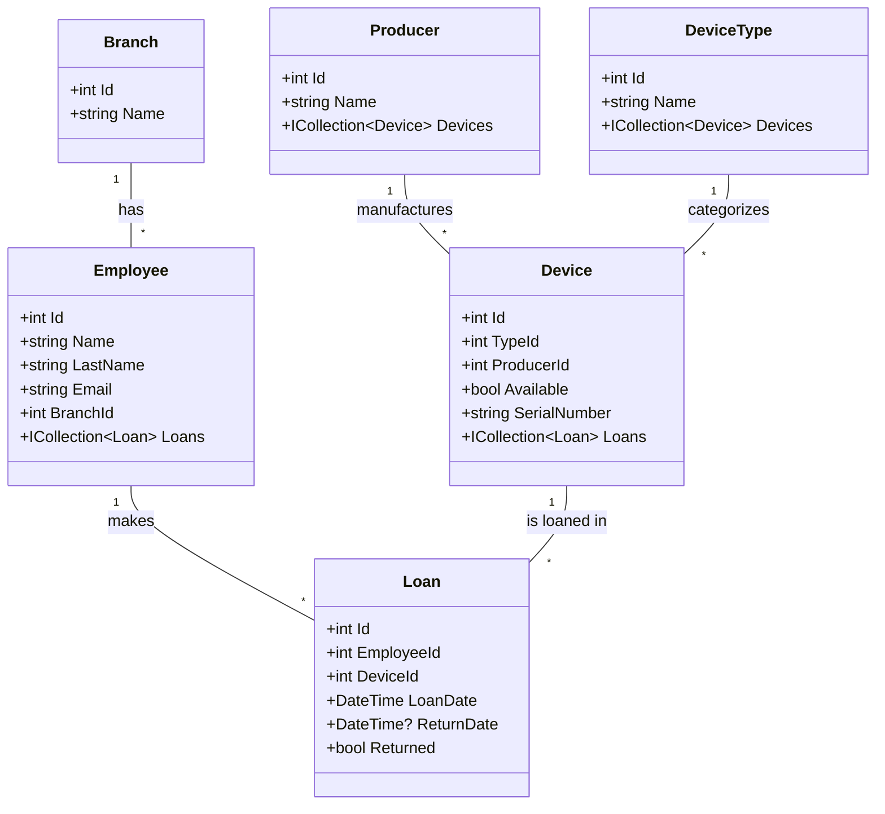

# emsAPI - Equipment Management System API

System zarządzania sprzętem firmowym (Equipment Management System) - REST API do obsługi wypożyczeń urządzeń dla pracowników.

## Spis treści

- [Opis projektu](#opis-projektu)
- [Technologie](#technologie)
- [Architektura](#architektura)
- [Struktura projektu](#struktura-projektu)
- [Model danych](#model-danych)
- [Endpointy API](#endpointy-api)
- [Instalacja i uruchomienie](#instalacja-i-uruchomienie)
- [Docker](#docker)
- [Testowanie](#testowanie)
- [Konfiguracja](#konfiguracja)

## Opis projektu

**emsAPI** to REST API służące do zarządzania wypożyczeniami sprzętu firmowego. System umożliwia:

- Zarządzanie pracownikami i oddziałami firmy
- Katalogowanie urządzeń według typu i producenta
- Obsługę wypożyczeń sprzętu przez pracowników
- Śledzenie dostępności urządzeń
- Historię wypożyczeń dla każdego pracownika

## Technologie

| Technologia | Wersja | Opis |
|------------|--------|------|
| .NET | 9.0 | Framework aplikacji |
| ASP.NET Core | 9.0 | Web API |
| Entity Framework Core | 9.0.12 | ORM |
| MySQL | 8.0 | Baza danych |
| Pomelo.EntityFrameworkCore.MySql | 9.0.0 | Provider MySQL dla EF Core |
| Swashbuckle (Swagger) | 10.1.0 | Dokumentacja API |
| NUnit | 4.2.2 | Framework testowy |
| Docker | 29.2.0 | Konteneryzacja |

## Architektura

Projekt wykorzystuje architekturę wielowarstwową z podziałem na osobne projekty:

```
┌─────────────────────────────────────────────────────────┐
│                    Controllers                          │
│              (Warstwa prezentacji API)                  │
├─────────────────────────────────────────────────────────┤
│                     Services                            │
│               (Logika biznesowa)                        │
├─────────────────────────────────────────────────────────┤
│                       Data                              │
│            (Warstwa dostępu do danych)                  │
├─────────────────────────────────────────────────────────┤
│                      Models                             │
│              (Encje domenowe)                           │
└─────────────────────────────────────────────────────────┘
```

**Wzorce projektowe:**
- **Dependency Injection** - wstrzykiwanie zależności przez konstruktor
- **Repository Pattern** - abstrakcja dostępu do danych przez serwisy
- **Interface Segregation** - interfejsy dla każdego serwisu

## Struktura projektu

```
emsAPI/
├── emsAPI/                     # Główny projekt Web API
│   ├── Program.cs              # Punkt wejścia aplikacji
│   ├── appsettings.json        # Konfiguracja
│   └── Properties/
│       └── launchSettings.json
│
├── Controllers/                # Kontrolery API
│   ├── BranchController.cs
│   ├── DeviceController.cs
│   ├── DeviceTypeController.cs
│   ├── EmployeeController.cs
│   ├── LoanController.cs
│   └── ProducerController.cs
│
├── Services/                   # Warstwa serwisów
│   ├── IBranchService.cs       # Interfejsy
│   ├── IDeviceService.cs
│   ├── IDeviceTypeService.cs
│   ├── IEmployeeService.cs
│   ├── ILoanService.cs
│   ├── IProducerService.cs
│   ├── BranchService.cs        # Implementacje
│   ├── DeviceService.cs
│   ├── DeviceTypeService.cs
│   ├── EmployeeService.cs
│   ├── LoanService.cs
│   └── ProducerService.cs
│
├── Models/                     # Modele danych
│   ├── Branch.cs
│   ├── Device.cs
│   ├── DeviceType.cs
│   ├── Employee.cs
│   ├── Loan.cs
│   └── Producer.cs
│
├── Data/                       # Warstwa danych
│   └── AppDbContext.cs
│
├── Tests/                      # Testy jednostkowe
│   ├── DeviceServiceTests.cs
│   └── LoanServiceTests.cs
│
├── dockerfile
├── docker-compose.yml
└── emsAPI.sln
```

## Model danych

### Diagram ERD



### Opis encji

| Encja | Opis |
|-------|------|
| **Branch** | Oddział firmy (np. "Warszawa", "Kraków") |
| **Employee** | Pracownik przypisany do oddziału |
| **Device** | Urządzenie z numerem seryjnym, typem i producentem |
| **DeviceType** | Kategoria urządzenia (np. "Laptop", "Monitor") |
| **Producer** | Producent urządzenia (np. "Dell", "HP") |
| **Loan** | Wypożyczenie urządzenia przez pracownika |

## Endpointy API

### Branch (Oddziały)

| Metoda | Endpoint | Opis |
|--------|----------|------|
| GET | `/api/Branch` | Pobierz wszystkie oddziały |
| GET | `/api/Branch/{id}` | Pobierz oddział po ID |
| POST | `/api/Branch` | Utwórz nowy oddział |
| PUT | `/api/Branch/{id}` | Aktualizuj oddział |
| DELETE | `/api/Branch/{id}` | Usuń oddział |

### Employee (Pracownicy)

| Metoda | Endpoint | Opis |
|--------|----------|------|
| GET | `/api/Employee` | Pobierz wszystkich pracowników |
| GET | `/api/Employee/{id}` | Pobierz pracownika po ID |
| POST | `/api/Employee` | Utwórz nowego pracownika |
| PUT | `/api/Employee/{id}` | Aktualizuj pracownika |
| DELETE | `/api/Employee/{id}` | Usuń pracownika |

### Device (Urządzenia)

| Metoda | Endpoint | Opis |
|--------|----------|------|
| GET | `/api/Device` | Pobierz wszystkie urządzenia |
| GET | `/api/Device/{id}` | Pobierz urządzenie po ID |
| GET | `/api/Device/available` | Pobierz dostępne urządzenia |
| GET | `/api/Device/producer/{producerId}` | Pobierz urządzenia danego producenta |
| GET | `/api/Device/type/{typeId}` | Pobierz urządzenia danego typu |
| POST | `/api/Device` | Utwórz nowe urządzenie |
| PUT | `/api/Device/{id}` | Aktualizuj urządzenie |
| DELETE | `/api/Device/{id}` | Usuń urządzenie |

### DeviceType (Typy urządzeń)

| Metoda | Endpoint | Opis |
|--------|----------|------|
| GET | `/api/DeviceType` | Pobierz wszystkie typy |
| GET | `/api/DeviceType/{id}` | Pobierz typ po ID |
| POST | `/api/DeviceType` | Utwórz nowy typ |
| PUT | `/api/DeviceType/{id}` | Aktualizuj typ |
| DELETE | `/api/DeviceType/{id}` | Usuń typ |

### Producer (Producenci)

| Metoda | Endpoint | Opis |
|--------|----------|------|
| GET | `/api/Producer` | Pobierz wszystkich producentów |
| GET | `/api/Producer/{id}` | Pobierz producenta po ID |
| POST | `/api/Producer` | Utwórz nowego producenta |
| PUT | `/api/Producer/{id}` | Aktualizuj producenta |
| DELETE | `/api/Producer/{id}` | Usuń producenta |

### Loan (Wypożyczenia)

| Metoda | Endpoint | Opis |
|--------|----------|------|
| GET | `/api/Loan` | Pobierz wszystkie wypożyczenia |
| GET | `/api/Loan/{id}` | Pobierz wypożyczenie po ID |
| GET | `/api/Loan/active` | Pobierz aktywne wypożyczenia |
| GET | `/api/Loan/user/{userId}/active` | Pobierz aktywne wypożyczenia użytkownika |
| GET | `/api/Loan/user/{userId}/history` | Pobierz historię wypożyczeń użytkownika |
| POST | `/api/Loan` | Utwórz nowe wypożyczenie |
| POST | `/api/Loan/{id}/return` | Zwróć urządzenie |
| PUT | `/api/Loan/{id}` | Aktualizuj wypożyczenie |
| DELETE | `/api/Loan/{id}` | Usuń wypożyczenie |

## Instalacja i uruchomienie

### Wymagania wstępne

- [.NET 9.0 SDK](https://dotnet.microsoft.com/download/dotnet/9.0)
- [MySQL 8.0](https://dev.mysql.com/downloads/mysql/) lub Docker

### Uruchomienie lokalne

1. **Sklonuj repozytorium:**
   ```bash
   git clone <repository-url>
   cd emsAPI
   ```

2. **Skonfiguruj bazę danych** w pliku `appsettings.json`:
   ```json
   {
     "ConnectionStrings": {
       "DefaultConnection": "server=localhost;port=3306;database=emsdb;user=emsuser;password=emspassword"
     }
   }
   ```

3. **Przywróć zależności:**
   ```bash
   dotnet restore
   ```

4. **Zbuduj projekt:**
   ```bash
   dotnet build
   ```

5. **Uruchom aplikację:**
   ```bash
   cd emsAPI
   dotnet run
   ```

6. **Otwórz Swagger UI:**
   ```
   http://localhost:5000/swagger
   ```

## Docker

### Uruchomienie z Docker Compose

Najłatwiejszy sposób uruchomienia aplikacji wraz z bazą danych:

```bash
docker compose up --build
```

To polecenie:
- Zbuduje obraz aplikacji
- Uruchomi kontener MySQL 8.0
- Uruchomi aplikację na porcie 5000

### Dostępne usługi

| Usługa | Port | Opis |
|--------|------|------|
| API | 5000 | REST API + Swagger UI |
| MySQL | 3306 | Baza danych |


### Zatrzymanie kontenerów

```bash
docker compose down
```

Aby usunąć także dane (volume):
```bash
docker compose down -v
```

## Testowanie

Projekt zawiera testy jednostkowe napisane w **NUnit** z wykorzystaniem **Entity Framework Core InMemory**.

### Uruchomienie testów

```bash
cd Tests
dotnet test
```

### Struktura testów

- `DeviceServiceTests.cs` - testy serwisu urządzeń
- `LoanServiceTests.cs` - testy serwisu wypożyczeń

Testy wykorzystują bazę InMemory, co zapewnia izolację i szybkość wykonania.

## Konfiguracja

### appsettings.json

```json
{
  "ConnectionStrings": {
    "DefaultConnection": "server=mysql;port=3306;database=emsdb;user=emsuser;password=emspassword"
  },
  "Logging": {
    "LogLevel": {
      "Default": "Information",
      "Microsoft.AspNetCore": "Warning"
    }
  },
  "AllowedHosts": "*"
}
```

## Przykłady użycia API

### Utworzenie producenta

```bash
{
  "name": "Dell"
}
```

### Utworzenie typu urządzenia

```bash
{
  "name": "Laptop"
}
```

### Utworzenie urządzenia

```bash
{
  "typeId": 1,
  "producerId": 1,
  "available": true,
  "serialNumber": "DELL-XPS-001"
}
```

### Wypożyczenie urządzenia

```bash
{
  "employeeId": 1,
  "deviceId": 1
}
```
